# 🤝 Marco Pasqualetti

I’m a web developer who loves crafting clean, maintainable code.

I’m always exploring new tools and techniques that make development smoother,\
from smarter build systems to better linting workflows.

<!-- markdownlint-disable MD033 -->

<picture>
  <source
    srcset="./profile/stats-dark.svg"
    media="(prefers-color-scheme: dark)"
  />
  <source
    srcset="./profile/stats-light.svg"
    media="(prefers-color-scheme: light), (prefers-color-scheme: no-preference)"
  />
  
</picture>

<!-- markdownlint-enable MD033 -->

## 🔭 I’m currently working on

<!-- markdownlint-disable MD033 -->

Figuring out what to do with my life

🤔💭🏃‍➡️🌉🫟

<!-- markdownlint-enable MD033 -->

## 💻 Development skills

### 📖 Programming languages

[JavaScriptBadge]: https://img.shields.io/badge/JavaScript-F7DF1E?style=for-the-badge&logo=JavaScript&logoColor=white
[TypescriptBadge]: https://img.shields.io/badge/TypeScript-007ACC?style=for-the-badge&logo=typescript&logoColor=white
[HTMLBadge]: https://img.shields.io/badge/HTML5-E34F26?style=for-the-badge&logo=html5&logoColor=white
[CSSBadge]: https://img.shields.io/badge/CSS3-1572B6?style=for-the-badge&logo=css3&logoColor=white
[SASSBadge]: https://img.shields.io/badge/Sass-CC6699?style=for-the-badge&logo=sass&logoColor=white

![JavaScript][JavaScriptBadge]
![Typescript][TypescriptBadge]
![HTML][HTMLBadge]
![CSS][CSSBadge]
![SASS][SASSBadge]

### 💡 Technologies

[NodeBadge]: https://img.shields.io/badge/Node.js-43853D?style=for-the-badge&logo=node.js&logoColor=white
[NodeURL]: https://nodejs.org/en
[ReactBadge]: https://img.shields.io/badge/React-20232A?style=for-the-badge&logo=react&logoColor=61DAFB
[ReactURL]: https://react.dev

[![NodeJS][NodeBadge]][NodeURL]
[![NodeJS][ReactBadge]][ReactURL]

### 🧑‍💻 IDE

[IntelliJBadge]: https://img.shields.io/badge/IntelliJ_IDEA-000000.svg?style=for-the-badge&logo=intellij-idea&logoColor=white
[IntelliJURL]: https://nodejs.org/en
[VSCodeBadge]: https://img.shields.io/badge/Visual_Studio_Code-0078D4?style=for-the-badge&logo=visual%20studio%20code&logoColor=white
[VSCodeURL]: https://react.dev

[![IntelliJ Idea][IntelliJBadge]][IntelliJURL]
[![VSCode][VSCodeBadge]][VSCodeURL]

## 😺 Interests

Below, you'll find a collection of my favorite topics across various areas of interest:

<!-- markdownlint-disable MD033 -->

📚 History

- Ancient Egypt 𓋹
- Ancient Rome 🏛️

⌨️🖱️ Video Games

- Halo 💍
- Mass Effect 🚀
- Horizon 🏹
- Outer Wilds 🌌
- Assassin's Creed 🗡️
- Dragon Age 🐉

📽️ Film / TV Series

- Star Wars ✨
- Marvel 📓 & 🎥 (Thanos team!)
- For All Mankind 🌌
- WestWorld 🦾
- Breaking Bad 💊

<!-- markdownlint-enable MD033 -->

## ⚡ Fun fact

Sometimes I pretend to be an Imperial Stormtrooper or Darth Maul

## README Repo CI status

[CIBadge]: https://img.shields.io/github/actions/workflow/status/marcalexiei/marcalexiei/ci.yml?style=for-the-badge&logo=github&event=push&label=CI
[CIURL]: https://github.com/marcalexiei/marcalexiei/actions/workflows/ci.yml

[![CI][CIBadge]][CIURL]

<!--
Here are some ideas to get you started:

-  ...
- 🌱 I’m currently learning ...
- 👯 I’m looking to collaborate on ...
- 🤔 I’m looking for help with ...
- 💬 Ask me about ...
- 📫 How to reach me: ...
- 😄 Pronouns: ...
-->
